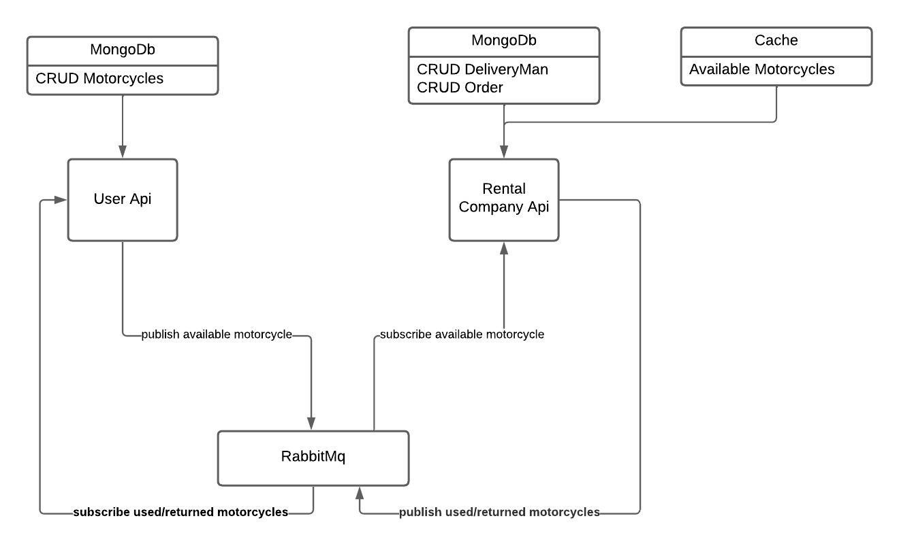

# Desafio Backend
 Esta aplicação simula de maneira simplificada o funcionamento de uma empresa de aluguel de motos.

## Tecnologias Utilizadas
- .NET 8
- MongoDB
- RabbitMQ
- Docker
- FluentValidation
- IMemoryCache

## Funcionalidades

- CRUD do Motorcycle
- CRUD do Order
- CRUD do DeliveryMan
- Comunicação entre as APIs User e RentalCompany, através do RabbitMQ
- Toda vez que um pedido é criado e simulado o valor do pedido
- Toda vez que o pedido for finalizado, é calculado o valor do pedido incluindo a multa em caso de atraso

Para esse projeto foram criadas duas APIs em .NET, sendo a User.API e RentalCompany.API.
A User.API é responsável pelo CRUD do Motorcycle, e também por enviar à Rental Company.API as motos disponíveis para o aluguel. Toda vez que é executado alguma ação do tipo Criar, Atualizar ou Deletar uma moto, será enviado todas as motos para o RabbitMQ.
A Rental Company é responsável pelo CRUD do DeliveryMan, e também para salvar localmente a imagem da CNH do mesmo, além disso, ela é responsável por criar e finalizar os pedidos de aluguel de motos. Toda vez que uma moto é alugada, é enviado a mensagem a User.API para atualizar o status da moto, tendo a moto atualizada, e reenviado as motos disponiveis para a RentalCompany.API, o mesmo ocorre quando uma moto é devolvida.

## Como rodar o projeto

- Para inicializar o RabbitMq e o MongoDB.
``` bash
docker-compose up
```

- Para iniciar as APIs, iniciar o terminal dentro da pasta desafio-backend
```bash
dotnet run --project ./User/User.Api/User.Api.csproj.
```
- Em outro terminal, executar
```bash
dotnet run --project ./RentalCompany/RentalCompany.Api/RentalCompany.Api.csproj
```

- Criar a pasta "C:\CnhImages", e habilitar as permissoes de escrita e leitura para que a API RentalCompany, consiga salvar e consultar as imagens da CNH gravadas.


## Melhorias

- Adicionar o Dockerfile nas APIs e integrar ao docker compose
- Adicionar Logs na API
- Adicionar Teste Unitarios
- Adicionar mais detalhes no Swagger, melhorei em alguns endpoints, mas não surgiu efeito, precisa ser verificado.
- Adicionar mais status ao pedido
- Adicionar campo email ao DeliveryMan e RentalCompany, para serem notificados quando for criado um pedido
- Adicionar API de Pagamento
